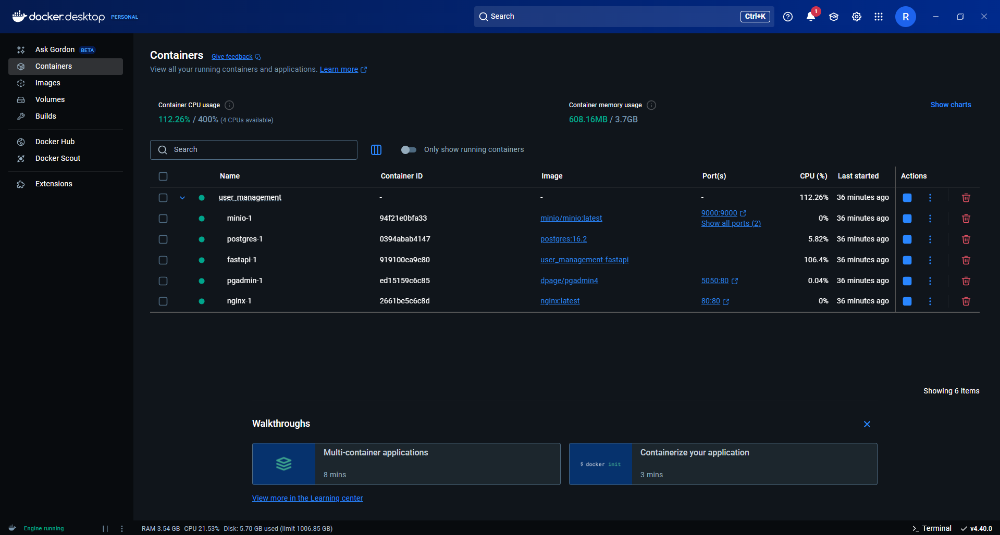
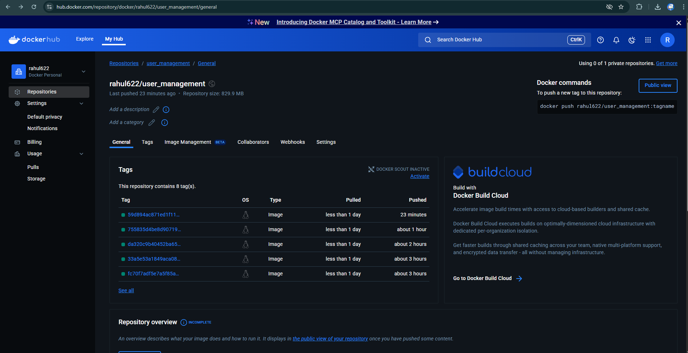
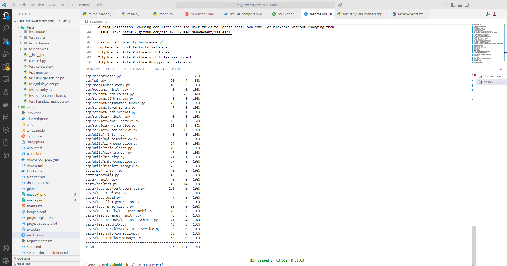

# User Management 📋

## Project Overview

The User Management System is a robust platform for managing user profiles, role assignments, and secure functionalities like password validation and image uploads. This project includes critical bug fixes, enhancements, and comprehensive testing to ensure a seamless user experience.

## Project Submissions 🌐

**Project Implementation and Testing**  
Click here ---> [Output Images & Docs](https://github.com/rahul7381/user_management/blob/main/Documentation/Output%20images.md)

**Docker Deployment**  
  

## Features Implemented

### 🚀 Enhanced Profile Picture Upload using MinIO
- Implemented image upload functionality with MinIO as the object storage system.
- File format validation: `.jpg`, `.jpeg`, `.png`.
- Image resizing for optimization.
- Secure storage and retrieval of image URLs.

### 🚀 Profile Picture Upload Feature
By enabling users to upload and save their profile photographs using MinIO, you improve the functionality of managing user profiles.  
**Feature Link:** [#12](https://github.com/rahul7381/user_management/issues/12)

### 🚀 MinIO Client Code Integration
Integrated MinIO server with the application to perform file upload operations.  
**Feature Link:** [#14](https://github.com/rahul7381/user_management/issues/14)

## Bugs Fixed

### 🐞 Dockerfile `libc-bin` Downgrade
- Added `--allow-downgrades` for `libc-bin=2.36-9+deb12u7` to the Dockerfile.
- Resolved mismatched library‑version errors in the build.  
**Issue Link:** [#1](https://github.com/rahul7381/user_management/issues/1)

### 🐞 `user-id` None on Email Verify
- Fixed missing user‑ID error when clicking verify.  
**Issue Link:** [#3](https://github.com/rahul7381/user_management/issues/3)

### 🐞 Password Strength Validation
- Enforced strong‑password checks during registration.  
**Issue Link:** [#8](https://github.com/rahul7381/user_management/issues/8)

### 🐞 Duplicate Email/Nickname Validation
- Excluded the current user from duplicate‑check during updates.  
**Issue Link:** [#10](https://github.com/rahul7381/user_management/issues/10)

## Testing and Quality Assurance 🧪

Implemented unit tests to validate:  
1. Upload Profile Picture with Bytes  
2. Upload Profile Picture with File‑Like Object  
3. Upload Profile Picture Unsupported Extension  
4. Get Profile Picture URL  
5. Successful email send  
6. Authentication failure  
7. Recipient refused  
8. Generic exception on connection  
9. Missing template read  
10. Email-style inlining on HTML tags  
11. Header + body + footer combination and Markdown rendering  
12. Multiple context-field interpolation  
13. Markdown list handling and special characters  
14. Header–body–footer ordering  

Improved test coverage to handle edge cases and ensure reliability.  
**Test Link:** [#19](https://github.com/rahul7381/user_management/issues/19)  

Project Setup ⚙️
Clone the Repository

git clone https://github.com/rahul7381/user_management.git
cd user_management  
Run Docker Containers

docker-compose up --build -d  
Run Migrations and Start Server

alembic upgrade head  
uvicorn app.main:app --reload  
Access the Application

API Documentation: http://localhost:8000/docs
Final Notes ✨
This project demonstrates a comprehensive approach to bug resolution, feature enhancement, and rigorous testing to deliver a reliable user management system.